# Pokemon Sprite Generator

| `Fire`  | `Water` | `Grass` | `Electric` | `Ice` | `Rock` | `Poison` |
| ---- | ---- |  ---- |  ---- | ---- | ---- | ---- | 
| 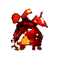  | 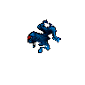 | 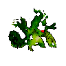 | 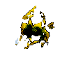 | 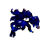 | 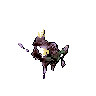 | 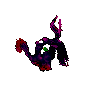 |

Generate a pokemon sprite, given specified classes.

This makes it a little different than other similar pokemon sprite generators - you are able to have more control over the sprite generation by indicating multiple types, rather than just getting a random pokemon of any type.

A complementary repository to the [PokemonGenerator Project](https://github.com/SpenDM/PokemonGenerator), which creates pokedex text entries based on type.

For some more nitty gritty technical details: The network is a hybrid between an adversarial autoencoder (AAE), a conditional autoencoder (CAE), and an autoencoding generative adversarial network (AEGAN) - see references below for my sources of inspiration! One of the attractive things about AEGAN is its training stability and robustness; I've had a lot of trouble in the past getting GANs to train stably, so this was a hugely appealing factor. Another cool aspect of this network was the concept of a "ColorPicker" (essentially a sprite color pallette), which greatly helps with the overall perceptual quality of the generated sprite. I decided to incorporate the conditional aspects of a CAE so I could get more controllable image generation. i.e., instead of just being able to generate a Pokemon, I'd be able to generate a Pokemon based on what types I specified.

Below is a rough architecture flow diagram of what's happening during training. In this case `x` and `r` are images, `z` are latents, and `y` are one-hot encoded type vectors. We can compute reconstruction losses between `recon_loss(x, r')` and generator GAN losses from  `disc_image(r)`, `disc_image(r')`, `disc_latent(z')`, and `disc_latent(z'')`. Conversely, we can compute discriminator losses from `disc_image(x)`, `disc_image(r)`, `disc_image(r')` and `disc_latent(z)`, `disc_image(z')`,`disc_image(z'')`. 

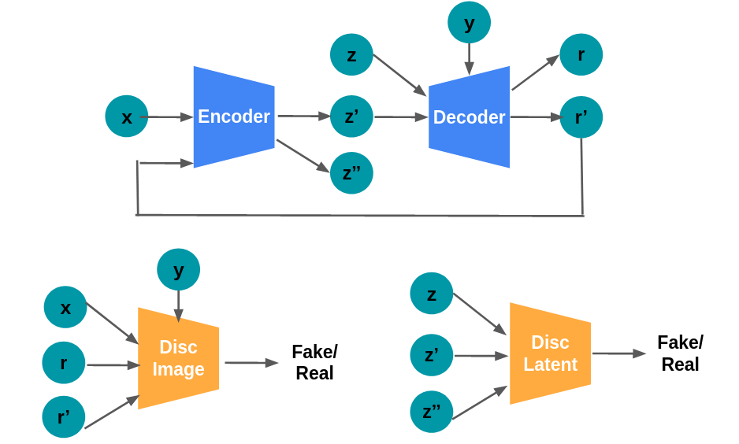

[NOTE] Results coming soon!

# Setup 

1. Download the data:
```
cd pokemon-sprite-generator/
git clone https://github.com/PokeAPI/sprites.git
mv sprites/sprites/pokemon/*.png data/
rm -rf sprites
mogrify -background white -flatten data/*.png
```

The associated type metadata is already provided at `sprites_metadata.csv`.

2. Install necessary python packages. If doing training, I'd highly reccomend using a GPU. These are the package versions I was using, but I'm sure it would work for other combinations as well.
```
python==3.6.12
torch==1.8.1+cu111
torchvision==0.9.1+cu111
PIL==8.0.1
tensorboard==2.5.0
numpy==1.19.4
```

3. (Optional) Download the pretrained model:
```
cd pokemon-sprite-generator/
mkdir pretrained
cd pretrained/
# TBD
wget <URL>
```

# Quick Start

The program is run via the command line. There are two modes, `train` or `sample`, which we'll outline in more detail below. For now, here is the full list of command line options:

```
python main.py -h

usage: main.py [-h] [--mode {train,sample}] [--save_dir SAVE_DIR]
               [--load_dir LOAD_DIR] [--use_gpu] [--root_dir ROOT_DIR]
               [--csv_file CSV_FILE] [--batch_size BATCH_SIZE]
               [--learning_rate LEARNING_RATE] [--num_epochs NUM_EPOCHS]
               [--types TYPES]

pokemon-sprite-generator options

optional arguments:
  -h, --help            show this help message and exit
  --mode {train,sample}
                        run the network in train or sample mode
  --save_dir SAVE_DIR   path to save model, logs, generated images
  --load_dir LOAD_DIR   path to model to load
  --use_gpu             if set, train on gpu instead of cpu
  --root_dir ROOT_DIR   path to the training data
  --csv_file CSV_FILE   path to the training data
  --batch_size BATCH_SIZE
                        batch size
  --learning_rate LEARNING_RATE
                        learning rate
  --num_epochs NUM_EPOCHS
                        number of epochs
  --types TYPES         pokemon types, comma seperated
``` 

## Train 

To train the network from scratch, I'd highly recommend using a CUDA-enabled GPU. It took me about 9 days on an nVidia GeForce RTX 2080. So, your command to train might look like:

```
python main.py --mode train --save_dir logs 
```

## Sample

If you'd like to sample a pokemon using the pre-trained model, make sure to first download the pre-trained model weights from step 3 of the `Setup` section. To generate a pokemon, your command might look like:

```
python main.py --mode sample --save_dir logs --load_dir pretrained --types Fire
```

You can choose from the following types: `Normal`, `Fire`, `Water`, `Grass`, `Flying`, `Fighting`, `Poison`, `Electric`, `Ground`, `Rock`, `Psychic`, `Ice`, `Bug`, `Ghost`, `Steel`, `Dragon`, `Dark`, or `Fairy`.

To generate a pokemon with multiple types, just seperate the type list with `/`. For example,

```
python main.py --mode sample --save_dir logs --load_dir pretrained --types Poison/Steel
```


# Results 

Here are some samples of generated sprites after training:
| `Fire`  | `Water` | `Grass` | `Electric` | `Ice` | `Rock` | `Poison` |
| ---- | ---- |  ---- |  ---- | ---- | ---- | ---- | 
|   |  |  |  |  |  |  |


Training takes patience! You can monitor your I imagine with some additional learning rate decay and additional steps, we could've gotten even better results. Here are some visualizations of randomly generated sprites at different points during training:

| Step   | Generated Image                  |
| ------ | -------------------------------- |
| 300    | 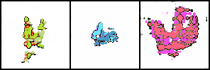     |
| 1300   | 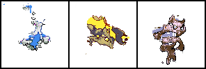   |
| 2540   | 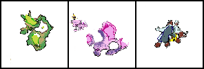   |
| 3820   | 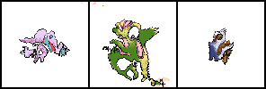   |
| 5940   | 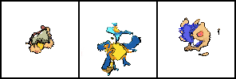   |
| 6920   | 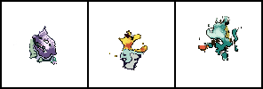   |
| 11300  | 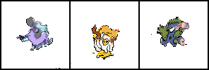 |
| 15000  | 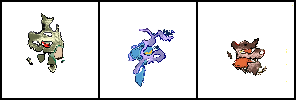 |
| 19500  | 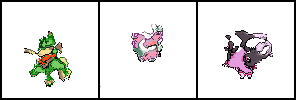 |

TBD - training curves, visualizations, etc.


# Observations

Some random observations I made while putting together this project! I've done GAN work before, but this is the first time I tried to put together a lot of the network architecture from scratch. A fun learning experience!
- Additional level of supervision given by reconstruction loss is a huge win in terms of training stability
- Checkerboard artifacts are alleviated by switching uses of ConvTranspose2D to Conv2D + Upsample layers. Another factor is the base image size you start with in your decoder - make sure it doesn't start too large, otherwise you'll get square artifacts.
- BatchNormalization is king! Trust me, just do it. Dropout is also very, very good.
- Soutmith Ganhack's repository is a great place to go if things are looking weird. Lots of great practical tips. Would suggest looking through the issue tracker as well if you have something specific you're running into that's not immediately addressed by the main page.
- Be patient. Things will look ugly at first, but will slowly improve and get better!


# References

Some inspirations for this work!

- AAE (Makhzani '15): [paper](https://arxiv.org/abs/1511.05644), [code](https://github.com/neale/Adversarial-Autoencoder)
- AEGAN (Lazarou '20): [paper](https://arxiv.org/abs/2004.05472), [code](https://github.com/ConorLazarou/PokeGAN)
- CAAE (Zhang '17): [paper](http://web.eecs.utk.edu/~zzhang61/docs/papers/2017_CVPR_Age.pdf), [code](https://github.com/mattans/AgeProgression/tree/v1.0.0)
- Soumith Ganhacks: [github](https://github.com/soumith/ganhacks)